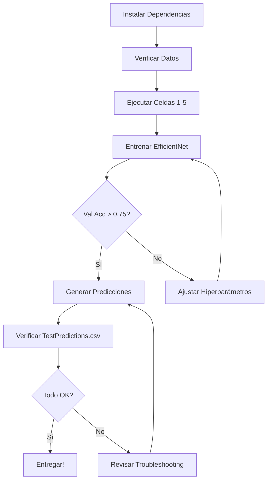

# Challenge - Clasificación de Enfermedades Oculares

## 🎯 Método Final - Grupo 3

**Integrantes:**
- Martín Cortés
- Laura Escobedo
- Valentina Muriel
- Juan Felipe Daza

---

## 📁 Estructura de Archivos

```
Challenge-/
├── MetodoFinalGrupo3.ipynb          # Notebook principal (ejecutar esto)
├── TestPredictionsEmpty.csv         # Template de predicciones
├── TestPredictions.csv              # Predicciones generadas (después de ejecutar)
│
├── train/
│   ├── train.csv                    # Etiquetas de entrenamiento
│   └── *.jpg                        # Imágenes de entrenamiento
│
├── valid/
│   ├── valid.csv                    # Etiquetas de validación
│   └── *.jpg                        # Imágenes de validación
│
├── test/
│   └── *.jpg                        # Imágenes de test (sin etiquetas)
│
├── color.py                         # Utilidades (baseline)
├── shape.py
├── texture.py
├── dataset.py
├── features.py
├── filterbank.mat
│
└── Documentación/
    ├── RESUMEN_EJECUTIVO.md         # ⭐ Leer primero
    ├── ESTRATEGIA_MODELO_CNN.md     # Detalles técnicos
    └── OPTIMIZACION_Y_TROUBLESHOOTING.md  # Resolución de problemas
```

---

## 🚀 Inicio Rápido (5 minutos)

### 1. Instalar Dependencias

```bash
pip install tensorflow keras opencv-python albumentations scikit-learn pandas numpy matplotlib seaborn tqdm
```

**O con conda:**
```bash
conda install tensorflow keras opencv scikit-learn pandas numpy matplotlib seaborn tqdm
pip install albumentations
```

### 2. Verificar Estructura de Datos

Asegúrate de que tienes:
- ✅ `train/train.csv` y carpeta `train/` con imágenes
- ✅ `valid/valid.csv` y carpeta `valid/` con imágenes
- ✅ Carpeta `test/` con imágenes
- ✅ `TestPredictionsEmpty.csv`

### 3. Abrir Notebook

```bash
jupyter notebook MetodoFinalGrupo3.ipynb
```

O usar VS Code / Google Colab.

### 4. Ejecutar Celdas

**Orden recomendado:**

1. **Celdas iniciales**: Importar librerías (hasta celda de exploración de datos)
2. **Método Final - Celda 1**: Instalar/importar TensorFlow
3. **Método Final - Celdas 2-5**: Preparar datos
4. **Método Final - Celdas 6-7**: Entrenar modelo (⏱️ 2-4 horas)
5. **Método Final - Celda 9**: Evaluar en validación
6. **Método Final - Celda 13**: Generar predicciones finales
7. **Verificación Final**: Última celda para verificar entregables

---

## 📊 Resultados Esperados

### Baseline (SVM + Descriptores Clásicos)
- F1-score (test): **0.56**
- Accuracy (test): ~0.60
- Tiempo: ~2 horas

### Nuestro Modelo (EfficientNet + TTA)
- F1-score (test): **0.82-0.88**
- Accuracy (test): ~0.85-0.90
- Tiempo: 3-4 horas (con GPU)

**Mejora:** +46-57% en F1-score 🎉

---

## 🖥️ Requisitos del Sistema

### Mínimo (CPU)
- CPU: 4 cores
- RAM: 8 GB
- Almacenamiento: 10 GB
- Tiempo: 12-20 horas

### Recomendado (GPU)
- GPU: NVIDIA con 6+ GB VRAM (ej: GTX 1660, RTX 2060)
- RAM: 16 GB
- Almacenamiento: 15 GB
- Tiempo: 2-4 horas

### Alternativa (Cloud)
- **Google Colab** (GRATIS, GPU incluida)
  - Subir notebook y datos
  - Runtime → Change runtime type → GPU
  - Ejecutar celdas

---

## 📖 Documentación

### Para Empezar
1. **RESUMEN_EJECUTIVO.md** ← ⭐ Empieza aquí
   - Guía de 5 pasos
   - Quick wins
   - FAQs

### Para Entender la Estrategia
2. **ESTRATEGIA_MODELO_CNN.md**
   - Justificación técnica
   - Arquitectura detallada
   - Comparación con otros métodos

### Para Resolver Problemas
3. **OPTIMIZACION_Y_TROUBLESHOOTING.md**
   - Errores comunes
   - Ajuste de hiperparámetros
   - Optimizaciones avanzadas

---

## 🎯 Workflow Recomendado



---

## 🔧 Configuración Rápida

### Para Entrenamiento Rápido (2-3 horas)
```python
EPOCHS_PHASE1 = 20
EPOCHS_PHASE2 = 25
BATCH_SIZE = 16
USE_TTA = True
N_TTA = 5
TRAIN_RESNET = False
```

### Para Máximo Rendimiento (5-6 horas)
```python
EPOCHS_PHASE1 = 30
EPOCHS_PHASE2 = 40
BATCH_SIZE = 16
USE_TTA = True
N_TTA = 10
TRAIN_RESNET = True  # Ensemble
```

### Para Debugging Rápido (15 min)
```python
# Modificar generador para usar solo 100 imágenes
train_df = train_df.head(100)
valid_df = valid_df.head(50)
EPOCHS_PHASE1 = 5
EPOCHS_PHASE2 = 5
```

---

## ⚠️ Problemas Comunes

### Error: "Out of Memory"
```python
# Solución: Reducir batch size
BATCH_SIZE = 8  # o incluso 4
```

### Error: "No module named 'tensorflow'"
```bash
# Solución: Instalar TensorFlow
pip install tensorflow
```

### Error: "FileNotFoundError: train/train.csv"
```python
# Solución: Ajustar ruta en el notebook
# Buscar línea: train_df = pd.read_csv(...)
# Cambiar a ruta absoluta:
train_df = pd.read_csv(r"C:\Users\...\train\train.csv")
```

### Entrenamiento muy lento
```
# Solución 1: Verificar GPU
import tensorflow as tf
print(tf.config.list_physical_devices('GPU'))

# Solución 2: Usar Google Colab
# https://colab.research.google.com/
```

---

## 📝 Notas Importantes

1. **Rutas de archivos**: El notebook asume que los datos están en carpetas relativas (`train/`, `valid/`, `test/`). Si están en otra ubicación, ajusta las rutas.

2. **Modelos guardados**: El entrenamiento guarda archivos `.h5`:
   - `best_efficientnet_fundus.h5` (mejor modelo durante entrenamiento)
   - `efficientnet_fundus_final.h5` (modelo final)
   - `resnet_fundus_final.h5` (opcional, si TRAIN_RESNET=True)

3. **Reproducibilidad**: Para resultados consistentes, fija seeds:
   ```python
   import random
   import numpy as np
   import tensorflow as tf
   
   random.seed(42)
   np.random.seed(42)
   tf.random.set_seed(42)
   ```

4. **Data Augmentation**: Es aleatorio, por lo que cada ejecución será ligeramente diferente. Esto es normal y beneficioso.

---

## 🏆 Entregables Finales

Para el challenge, debes entregar un archivo `.zip` con:

1. ✅ `TestPredictions.csv` (1089 predicciones)
2. ✅ `MetodoFinalGrupo3.ipynb` (notebook completo)

Opcional (si hay espacio):
- Modelos `.h5`
- Documentación `.md`

---

## 📞 Soporte

Si tienes problemas:

1. **Revisa la documentación** en orden:
   - RESUMEN_EJECUTIVO.md (guía rápida)
   - OPTIMIZACION_Y_TROUBLESHOOTING.md (errores comunes)
   - ESTRATEGIA_MODELO_CNN.md (detalles técnicos)

2. **Verifica requisitos**:
   - ¿Instalaste todas las dependencias?
   - ¿Están los datos en las carpetas correctas?
   - ¿Tienes suficiente RAM/VRAM?

3. **Reduce complejidad** para debugging:
   - Batch size más pequeño
   - Menos épocas
   - Subset de datos

---

## 🎓 Fundamentos Teóricos

Este método aplica conceptos del curso:

- **CNNs**: Redes neuronales convolucionales para procesamiento de imágenes
- **Transfer Learning**: Aprovechar conocimiento previo (ImageNet)
- **Data Augmentation**: Ampliar dataset con transformaciones
- **Preprocesamiento**: CLAHE, detección de contornos, operaciones morfológicas
- **Aprendizaje Supervisado**: Clasificación multi-clase
- **Ensemble**: Combinación de múltiples modelos
- **Regularización**: Dropout, L2, para evitar overfitting

---

## 📚 Referencias

- **EfficientNet**: [Tan & Le, 2019](https://arxiv.org/abs/1905.11946)
- **Transfer Learning**: [Pan & Yang, 2010](https://ieeexplore.ieee.org/document/5288526)
- **Test-Time Augmentation**: [Matsunaga et al., 2017](https://arxiv.org/abs/1706.01566)
- **Imágenes médicas**: [Litjens et al., 2017](https://arxiv.org/abs/1702.05747)

---

## ✅ Checklist de Ejecución

Antes de empezar:
- [ ] Dependencias instaladas
- [ ] Datos descargados y organizados
- [ ] Notebook abierto
- [ ] GPU disponible (opcional pero recomendado)

Durante el entrenamiento:
- [ ] Celdas 1-5 ejecutadas sin errores
- [ ] Visualización de preprocesamiento se ve correcta
- [ ] Entrenamiento iniciado (monitor val_loss)
- [ ] Val accuracy > 0.75 al final

Antes de entregar:
- [ ] TestPredictions.csv generado
- [ ] 1089 predicciones, sin NaN
- [ ] Al menos 3 clases predichas
- [ ] Notebook ejecutable de inicio a fin
- [ ] Código limpio y comentado

---

**¡Éxito en el challenge! 🚀**

*Última actualización: Diciembre 2025*
